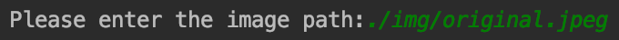

# ordered-dither-imageProcessor!
This project is an implementation of a program to convert an RGB-coloured image to an 8-bit grayscale image and then performe an ordered dither algorithm on the result.
## Description
This program uses the formula below (luminosity method) to convert the RGB-coloured image (which its path is provided by the user) to an 8-bit  grayscale image:
```
Grayscale = 0.299 * R + 0.587 * G + 0.114 * B
```
Next, it creates a Bayer matrix with the size also provided by the user (the choice must be among 2, 4, 8 and 16).

## Usage
First the user needs to provide the path to an arbitrary image
<p align="center">
  
</p>
The program will then display and save the result of the conversion to the user. Next the user needs to provide the size of the Bayer matrix   
<p></p>
<p align="center">
  
</p>
The program will then display the result of the ordered-dither to the user.

## Examples
The original image

<p align="center">
  
</p>
8-bit grayscale image  
<p></p>
<p align="center">
  
</p>
<p></p>
Ordered dithered image (implemented with 16*16 Bayer matrix)  
<p></p>
<p align="center">
  
</p>
<p></p>
Ordered dithered image (implemented with 8*8 Bayer matrix)  
<p></p>
<p align="center">
  
</p>
<p></p>
Ordered dithered image (implemented with 4*4 Bayer matrix)  
<p></p>
<p align="center">
  
</p>
<p></p>
Ordered dithered image (implemented with 2*2 Bayer matrix)  
<p></p>
<p align="center">
  
</p>
